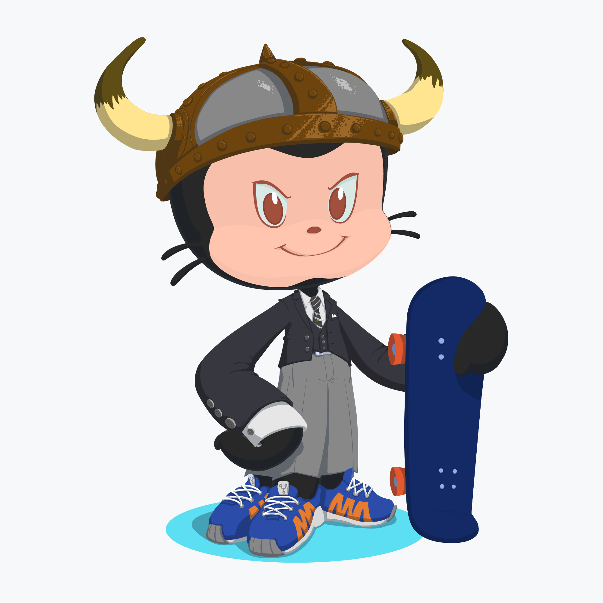
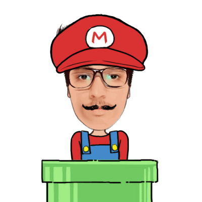

<h1 align="center" > :rocket: Deepak Agrawal :rocket: </h1>

  
  
  
  
  

  

- 🔭 I’m currently working on **ReactJS**, **Strapi**, **APIs**
- 🌱 I’m developing skills in **Web Developement** and **Open Source Contributions**
- 👯 I’m looking to collaborate on _**Open Source**_ and _**Personal**_ projects.

 
  
  

  
  

  
   
  
   
  

